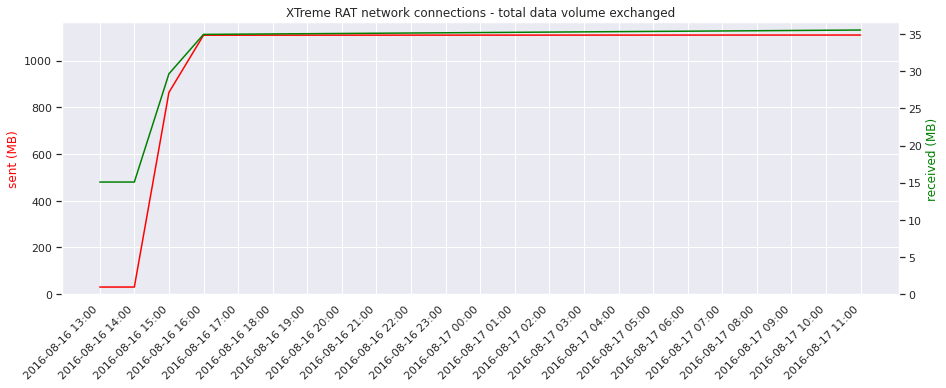

# Forensic as Code
## Content

- case 1: forensic analysis of a single Windows disk
    - resulting timeline, with raw events and comments: [timeline](./case_1/timeline.csv)
    - some visualizations built:  
    
    
- case 2: forensic analysis of multiple disks, from Velociraptor data collections
    - resulting timeline, with raw events and comments: [timeline](./case_2/timeline.csv)
    - some visualizations built:  
    
    
- case 3: Markov chain for the triage of noisy events (should work ... coming later)
- case 4: analyzing pattern, uncover anomalies in network logs (trend, seasonnality) (coming later)

## Why
These notebooks are a set of write-ups mining data with Pandas to solve a forensic analysis.
There are plenty of software around to do it (Autopsy, TimeSketch, X-Ways Forensics, Excel sheets, ELK, Splunk, ...), so why bother with something different ? 
In my journey as a forensic analyst, I came to some observations:
- We often need to collaborate and split the work between coworkers, and it's difficult to converge to similar details level of notes, hence to continue the work of someone else
- Even if we manage to centralize our notes, we often interrupt our analysis to copy our notes, check the others, then pursue our analysis
- Analysis is often dispatched in multiple storages (data in one, timeline in another, notes in yet another one, ...)  
- Software with a graphical interface have limitations, especially regarding filtering, visualizations and adding some information on the go
- It's difficult to keep a global overview, to visualize a case and keep track of the grey areas while we progress
- Building a consistent and comprehensive timeline is difficult

That's why I give a try to the data scientist approach: forensic is an example of exploratory data analysis (EDA) on time series, and the evil are anomalies, hidden in plain sight. 
Statistics and visualizations from EDA seems relevant to extract the chain of events in forensic. 
Anomaly detection methods can be used for instance when hunting the evil in big amount of logs.

I choose to use Pandas and Jupyter Notebooks:
- Pandas is a python library to explore, aggregate, filter, query, visualize tabular data
- Built on top of numpy, it offers better performance than native Python data structure in the context of scientific computation
- All the data will be handled in the same DataFrame, indexed by the time
- The learning curve is moderate (python based, big community, only few distinct functions needed to get basic results)
- The only limitation is our imagination: we can filter and aggregate part of the DataFrame at will
- Everyone can write its notebook, so that peers can view the code that led to the finding, maybe identify a mistake, get a new idea to continue the analysis
- We don't need to stop analyzing to write some notes for peers: anyone can browse the notebooks on the go and adjust where to put the efforts on.
- The analysis can be reproduced: just load the kernel, and execute cells
- We can also add new columns to ease the filtering, to save important events as we progress, to add a custom comment
- We can create visualizations directly from the data
- We can test and get instant feedback of our result, and only keep what is relevant for the case
- We can have text cells to attach a note about a finding: notes, data and results are centralized

The write-ups are more detailed than in a real investigation to explain both Pandas capabilities and the interpretation of artifacts.

## Notes for disks forensic write-ups
The write-ups are focused on the analysis and do not deal with data collection and extraction. 
For a disk analysis, the preliminary work is to:
- acquire the disk, or collect live artifacts from an agent (Velociraptor, GRR, ...)
- extract and parse the artifacts
- assemble them in a uniform structure in json

Indeed all the disk artifacts comes with their own heterogeneous structure: there is often no common fields except the timestamp. 
Hence, a limited number of fields are loaded in the notebooks. 
When an event is worth it, we can still refer to the full json to obtain the details. 

The extraction, parsing and transformation steps was done with the following tools:
- The Sleuth Kit for the MFT, which produces a csv file (https://www.sleuthkit.org/sleuthkit/)
- Log2timeline, which produces a nested ndjson (https://github.com/log2timeline/plaso)
- py_fair, my own script to assemble all the outputs in a unified time series (https://github.com/b4stet/py_fair).
